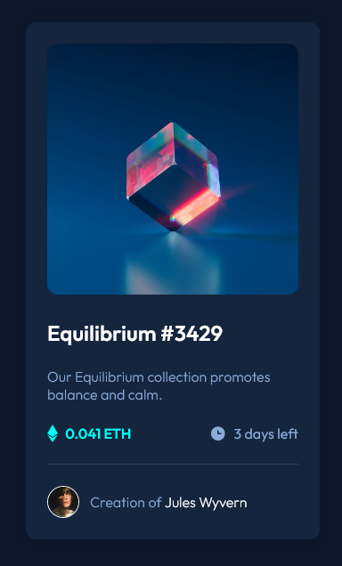

# Frontend Mentor - NFT preview card component solution

This is a solution to the [NFT preview card component challenge on Frontend Mentor](https://www.frontendmentor.io/challenges/nft-preview-card-component-SbdUL_w0U). Frontend Mentor challenges help you improve your coding skills by building realistic projects.

## Table of contents

- [Overview](#overview)
  - [The challenge](#the-challenge)
  - [Screenshot](#screenshot)
- [My process](#my-process)
  - [Built with](#built-with)
  - [What I learned](#what-i-learned)
- [Author](#author)

## Overview

### The challenge

Users should be able to:

- View the optimal layout depending on their device's screen size
- See hover states for interactive elements

### Screenshot



### Links

- Solution URL: [https://github.com/devshot-dotcom/nft-card-component](https://github.com/devshot-dotcom/nft-card-component)
- Live Site URL: [https://devshot-dotcom.github.io/nft-card-component](https://devshot-dotcom.github.io/nft-card-component)

## My process

Pretty simple; HTMl w/BEM naming convention, and CSS.

### Built with

- Semantic HTML5 markup
- CSS custom properties
- Flexbox
- Mobile-first workflow

### What I learned

Practiced some more of BEM naming convention, see below:

```html
<main class="card__body">
  <h2 class="card__title">Etherium</h2>
  <p>Lorem ipsum sit dolor amit bruh.</p>
</main>
```

```css
.card__body {
  color: papayawhip;
}

.card__title {
  font-size: 1.5rem;
}
```

## Author

[**devshot.com**](https://devshot-dotcom.github.io)

- Frontend Mentor - https://www.frontendmentor.io/profile/devshot-dotcom
- Youtube: https://www.youtube.com/channel/UCYCAUsfy9JybOT-DvdTV_sA
- Github Profile: https://github.com/devshot-dotcom/
- Portfolio: https://devshot-dotcom.github.io/
- Medium Profile: https://devshot-coffee.medium.com/
- Dev Profile: https://dev.to/devshotdotcom
- Hashnode Profile: https://hashnode.com/@devshot
- Instagram Profile: https://www.instagram.com/devshotdotcom/
